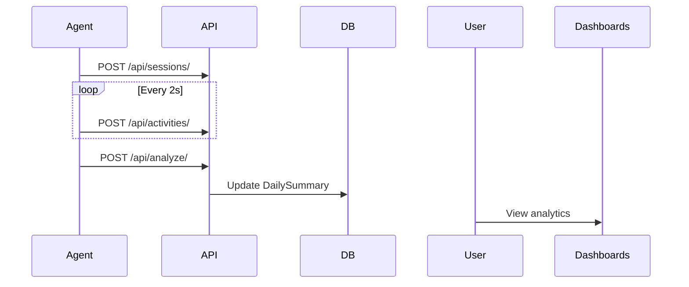

# Employee Activity Tracker - Data Flow Document

## 1. System Overview
- Real-time activity capture via desktop agent
- Data sent to Django REST API, stored in MySQL
- AI engine classifies activities, calculates productivity, burnout risk
- Dashboards for Employees, HR/Admins; CSV exports

## 2. Data Entities & Relationships

**Main Models:**
- User (role-based: EMPLOYEE, HR, ADMIN)
- WorkSession (one per day per user)
- ActivityLog (raw activity, APP/WEB/IDLE, start/end/duration)
- DailySummary (aggregated analytics per user per day)

**Relationships:**
- User → WorkSession (1-to-many)
- User → ActivityLog (1-to-many)
- WorkSession → ActivityLog (1-to-many)
- User → DailySummary (1-to-many)

## 3. API Endpoints

- `/api/sessions/` (POST): Create work session
- `/api/activities/` (POST): Log activity
- `/api/analyze/` (POST): Trigger daily analysis
- Dashboards: `/api/dashboard/my-stats/`, `/api/dashboard/hr/`, etc.

## 4. Desktop Agent Data Capture

- Polls active window every 2s
- Detects idle (no input ≥ 60s) via Windows API
- Logs activity on window/idle state change
- Sends data to backend via REST API

## 5. Backend Processing & Business Logic

- `classify_activity()`: Categorizes activity as PRODUCTIVE, UNPRODUCTIVE, NEUTRAL
- `run_daily_analysis()`: Aggregates logs, calculates scores, burnout risk, updates DailySummary

## 6. Data Flow Diagrams

**Sequence:**

## 7. Typical Work Session Sequence

- Agent starts → creates WorkSession
- Logs activities (APP/WEB/IDLE) as user works/idle
- On shutdown, triggers daily analysis
- AI engine classifies, aggregates, updates DailySummary
- Dashboards display results

## 8. Dashboard & Reporting

- Employee: Personal productivity trends, daily scores
- HR/Admin: Org-wide KPIs, time distribution, advanced reports, CSV exports

## 9. Authentication & Security

- Django auth, role-based access control
- Secure endpoints, session management

---